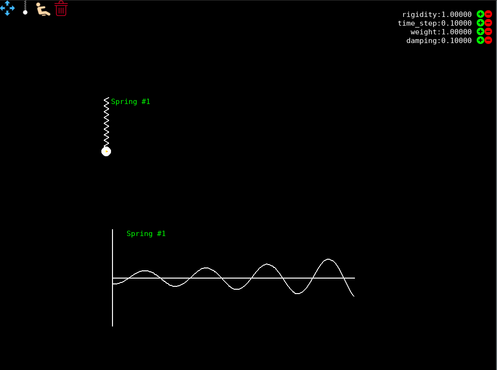
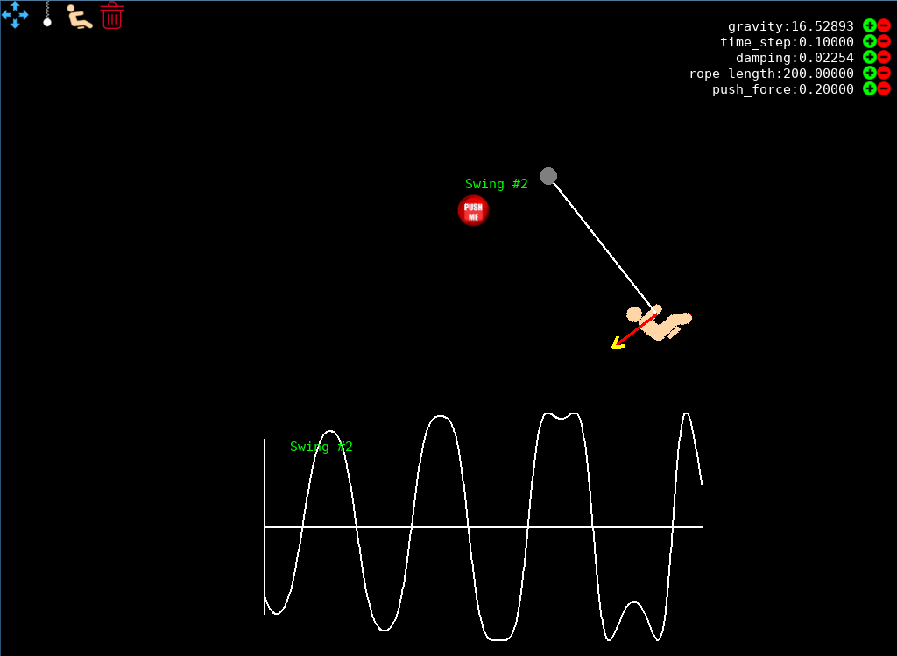

# Harmonic oscillator simulation
Simulates (dampened) harmonic oscillators we all learned about in highschool physics classes.
Namely:
- weight on a spring
- pendulum

The deflection is plotted as a function of time.

## Setup
```
pip install -r requirements.txt
```

## Running
```
$ python simulation.py
```


## Weight on a spring



## Pendulum



